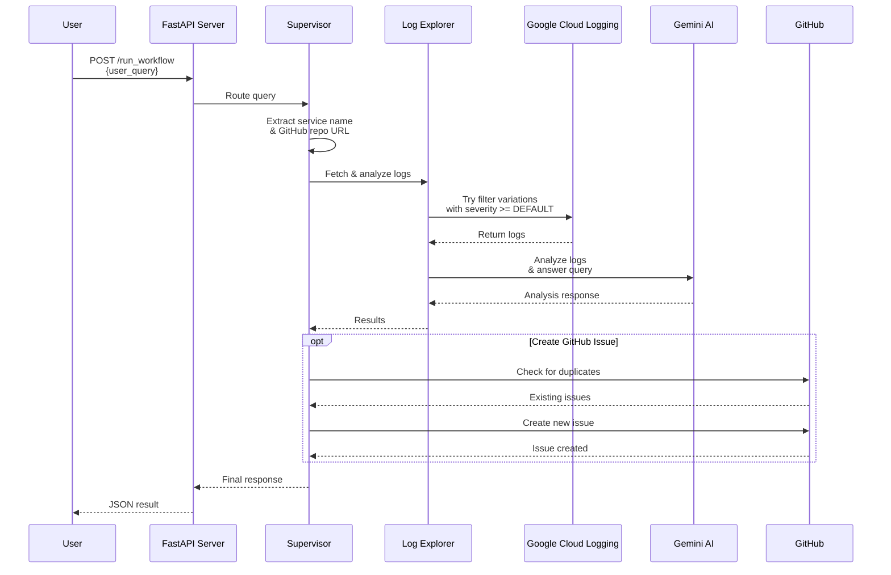
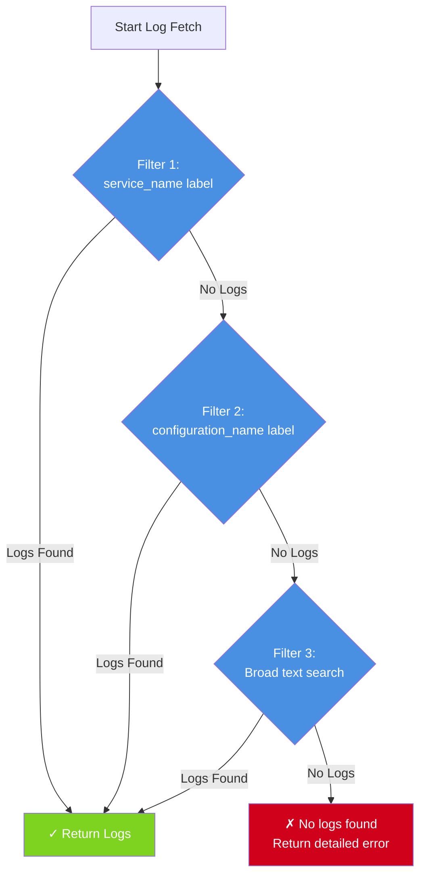
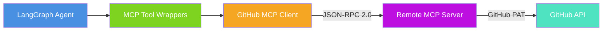

# Agentic Log Attacker

An AI-powered log monitoring and issue management system that uses LangGraph to orchestrate multiple specialized agents. The system monitors logs from multiple Google Cloud Platform services (Cloud Run, Cloud Build, Cloud Functions, GCE, GKE, App Engine), analyzes them using the Gemini API, identifies issues, and can automatically create GitHub issues with suggested fixes.

## A2A Integration with Dev-Nexus

This service is now integrated with the **A2A (Agent-to-Agent) protocol** and can be called by [dev-nexus](https://github.com/patelmm79/dev-nexus) and other A2A-compatible agents.

### Quick Start for Dev-Nexus Integration

1. **Service URL**: https://agentic-log-attacker-665374072631.us-central1.run.app
2. **Service Discovery**: https://agentic-log-attacker-665374072631.us-central1.run.app/.well-known/agent.json
3. **A2A Skill**: `analyze_and_monitor_logs`

### Calling the Service from Dev-Nexus

```python
import requests
from google.auth import default
from google.auth.transport.requests import Request
from google.oauth2 import id_token

# Get identity token for the service
credentials, _ = default()
target_audience = "https://agentic-log-attacker-665374072631.us-central1.run.app"
token = id_token.fetch_id_token(Request(), target_audience)

# Call the A2A endpoint
response = requests.post(
    f"{target_audience}/a2a/execute",
    headers={"Authorization": f"Bearer {token}"},
    json={
        "skill_id": "analyze_and_monitor_logs",
        "input": {
            "user_query": "analyze logs for cloud run service my-service",
            "service_name": "my-service",
            "service_type": "cloud_run",
            "repo_url": "https://github.com/owner/repo"
        }
    }
)

result = response.json()
```

## Features

- **🔍 Intelligent Log Monitoring:** Advanced log retrieval from multiple GCP services (Cloud Run, Cloud Build, Cloud Functions, GCE, GKE, App Engine) with multiple filter strategies and severity-based filtering
- **🤖 Multi-Agent Architecture:** Uses LangGraph to coordinate specialized AI agents for different tasks
- **📊 Issue Detection:** Analyzes logs using Gemini API to identify potential issues and patterns
- **🐙 GitHub Integration:** Automatically creates GitHub issues with duplicate detection
- **🔧 Automated Code Fixes:** Generates code fixes using AI and creates pull requests
- **💬 Conversational Interface:** Natural language queries to explore logs and issues
- **☁️ Multi-Service Support:** Monitor logs from Cloud Run, Cloud Build, Cloud Functions, GCE, GKE, and App Engine

## Architecture

This application uses **LangGraph's StateGraph** to orchestrate multiple specialized agents that work together to analyze logs and manage issues.

### Multi-Agent System


### Agent Workflow Process



### Multi-Service Log Support

The system supports monitoring logs from multiple Google Cloud Platform services:

| Service Type | Resource Type | Example Service Names |
|-------------|---------------|----------------------|
| **Cloud Run** | `cloud_run_revision` | Service names (e.g., `my-api-service`) |
| **Cloud Build** | `build` | Build IDs or trigger IDs (e.g., `abc-123`) |
| **Cloud Functions** | `cloud_function` | Function names (e.g., `my-auth-handler`) |
| **GCE** | `gce_instance` | Instance IDs or names (e.g., `my-vm-1`) |
| **GKE** | `k8s_container` | Cluster, namespace, or pod names |
| **App Engine** | `gae_app` | Module or version IDs |

Each service type has multiple filter variations to ensure successful log retrieval. The system automatically tries different label fields (e.g., `service_name`, `configuration_name`, `build_id`) to maximize compatibility with different GCP configurations.

### Log Retrieval Strategy

The system uses an intelligent multi-filter approach to retrieve logs:



**All filters include:** `severity >= DEFAULT` to capture logs at all severity levels (DEFAULT, DEBUG, INFO, WARNING, ERROR, etc.)

## GitHub Integration via Model Context Protocol (MCP)

The system supports GitHub operations through the **Model Context Protocol (MCP)**, a standardized way for AI agents to interact with external tools and services.

### MCP Architecture



### MCP Components

**1. GitHub MCP Client** (`src/clients/github_mcp_client.py`)
- JSON-RPC 2.0 protocol implementation over HTTPS
- Connects to remote MCP server
- Authentication via GitHub Personal Access Token
- Context manager support for automatic cleanup

**2. LangChain Tool Wrappers** (`src/tools/github_mcp_tools.py`)
- `mcp_create_github_issue` - Create GitHub issues
- `mcp_list_github_issues` - List repository issues
- `mcp_create_pull_request` - Create pull requests
- `mcp_get_file_contents` - Read file contents
- `mcp_search_code` - Search code across GitHub
- `mcp_list_available_tools` - Discover available operations

### MCP Configuration

Add to your `.env` file:

```bash
# GitHub Personal Access Token (required)
GITHUB_TOKEN=ghp_your_github_personal_access_token

# Remote MCP Server URL (optional, uses GitHub Copilot endpoint by default)
GITHUB_MCP_SERVER_URL=https://api.githubcopilot.com/mcp
```

### MCP Usage Example

```python
from src.clients.github_mcp_client import create_github_mcp_client

# Create and use MCP client
with create_github_mcp_client() as client:
    # List available tools
    tools = client.list_tools()

    # Create an issue
    issue = client.create_issue(
        owner="octocat",
        repo="Hello-World",
        title="Bug report",
        body="Something is broken"
    )

    # Create a pull request
    pr = client.create_pull_request(
        owner="octocat",
        repo="Hello-World",
        title="Fix bug",
        body="This fixes the issue",
        head="feature-branch",
        base="main"
    )
```

### Integration with Agents

```python
from src.tools.github_mcp_tools import ALL_MCP_TOOLS
from langchain_google_genai import ChatGoogleGenerativeAI
from langgraph.prebuilt import create_react_agent

# Create agent with MCP tools
llm = ChatGoogleGenerativeAI(model="gemini-2.5-flash")
agent = create_react_agent(llm, tools=ALL_MCP_TOOLS)

# Use the agent
result = agent.invoke({
    "messages": [("user", "List open issues in https://github.com/owner/repo")]
})
```

### Why Use MCP?

- ✅ **Standardized Protocol:** Uniform interface across different services
- ✅ **Future-Proof:** Easy to add new tools without changing agent code
- ✅ **Tool Discovery:** Agents can dynamically discover available operations
- ✅ **Separation of Concerns:** Clean separation between agent logic and GitHub operations

📖 **Detailed MCP Documentation:** See [README_MCP.md](README_MCP.md) for complete MCP client documentation, troubleshooting, and advanced usage.

## Setup

1. **Install dependencies:**

   ```bash
   pip install -r requirements.txt
   ```

2. **Set up your environment variables:**

   Create a `.env` file in the root of the project and add the following:

   ```bash
   # Required: Gemini AI API
   GEMINI_API_KEY="YOUR_GEMINI_API_KEY"
   GEMINI_MODEL_NAME="gemini-2.5-flash"

   # Required: GitHub Integration (PyGithub or MCP)
   GITHUB_TOKEN="YOUR_GITHUB_TOKEN"
   GITHUB_REPOSITORY="YOUR_GITHUB_REPOSITORY"

   # Optional: GitHub MCP Server (for Model Context Protocol)
   GITHUB_MCP_SERVER_URL="https://api.githubcopilot.com/mcp"

   # Required: Google Cloud Platform
   GOOGLE_CLOUD_PROJECT="YOUR_GOOGLE_CLOUD_PROJECT"
   CLOUD_RUN_SERVICE_NAME="YOUR_CLOUD_RUN_SERVICE_NAME"
   CLOUD_RUN_REGION="YOUR_CLOUD_RUN_REGION"
   ```

   **GitHub Integration Options:**
   - **PyGithub (Default):** Direct GitHub API integration via `PyGithub` library
   - **MCP (Optional):** Model Context Protocol for standardized GitHub operations
     - Requires `GITHUB_MCP_SERVER_URL` environment variable
     - See [README_MCP.md](README_MCP.md) for setup details

3. **Authenticate with Google Cloud:**

   ```bash
   gcloud auth application-default login
   ```

## Agent Descriptions

### 🎯 Supervisor Agent
- **Purpose:** Entry point and orchestrator
- **Responsibilities:** Routes user queries, extracts service names and GitHub URLs, decides which agent to invoke
- **Location:** `src/agents/supervisor.py`

### 📋 Log Explorer Agent
- **Purpose:** Log retrieval and analysis
- **Responsibilities:** Fetches GCP logs using multiple filter strategies, summarizes large log volumes, answers questions about log content
- **Location:** `src/agents/log_explorer.py`
- **Features:**
  - Tries 3 filter variations for log retrieval
  - Automatic log summarization for volumes >200 lines
  - Maintains conversation context for follow-up queries

### 🔨 Issue Creation Agent
- **Purpose:** Issue identification and structuring
- **Responsibilities:** Analyzes logs to identify problems, structures issues with priority and context
- **Location:** `src/agents/issue_creation_agent.py`

### 💡 Solutions Agent
- **Purpose:** Recommendation provider
- **Responsibilities:** Provides actionable recommendations for identified issues
- **Location:** `src/agents/solutions_agent.py`

### 🐙 GitHub Issue Manager Agent
- **Purpose:** GitHub integration
- **Responsibilities:** Creates GitHub issues, checks for duplicates, handles issue metadata
- **Location:** `src/agents/github_issue_manager.py`
- **Integration Options:**
  - **PyGithub:** Direct GitHub API integration (default)
  - **MCP Client:** Model Context Protocol for standardized GitHub operations
- **Features:**
  - Duplicate detection (checks open and closed issues)
  - Skips issues closed with "wontfix" label
  - Extracts repo URLs from conversation history

### 🔧 Code Fixer Agent
- **Purpose:** Automated fix generation
- **Responsibilities:** Generates code fixes, creates branches, commits changes, creates pull requests
- **Location:** `src/agents/code_fixer.py`
- **Workflow:**
  1. Clones repository to temp directory
  2. Uses LLM to identify relevant files
  3. Reads only relevant files (reduces token usage)
  4. Generates fix and creates new branch
  5. Commits changes and creates PR

## Usage

### Running Locally (FastAPI)

To run the FastAPI application locally:

```bash
uvicorn src.main:app --host 0.0.0.0 --port 8080
```

The API will be available at `http://localhost:8080`. You can access the interactive API documentation at `http://localhost:8080/docs`.

### API Endpoints

#### `GET /`
Health check endpoint.

**Response:**
```json
{
  "message": "Agentic Log Attacker API is running!"
}
```

#### `POST /run_workflow`
Execute the multi-agent workflow with a user query.

**Request Body:**
```json
{
  "user_query": "review logs for cloud run service my-service",
  "service_name": "my-service",
  "service_type": "cloud_run",
  "repo_url": "https://github.com/owner/repo"
}
```

**Supported Service Types:**
- `cloud_run` - Cloud Run services (default)
- `cloud_build` - Cloud Build builds
- `cloud_functions` - Cloud Functions
- `gce` - Google Compute Engine instances
- `gke` - Google Kubernetes Engine clusters
- `app_engine` - App Engine services

**Example Queries:**
- `"review logs for cloud run service vllm-gemma-3-1b-it"`
- `"analyze cloud build logs for build-abc-123"`
- `"check cloud function my-auth-handler for errors"`
- `"what errors occurred in gce instance my-vm?"`
- `"summarize recent logs for gke cluster production-cluster"`
- `"create an issue for the authentication failures"`

**Example with Service Type:**
```json
{
  "user_query": "What errors occurred in my recent builds?",
  "service_name": "my-build-trigger",
  "service_type": "cloud_build",
  "repo_url": "https://github.com/myorg/myrepo"
}
```

**Response:**
```json
{
  "result": {
    "service_name": "my-service",
    "service_type": "cloud_run",
    "messages": [...],
    "issues": [...],
    "orchestrator_history": [...]
  }
}
```

## Development

### Running Tests

```bash
# Run all tests
pytest

# Run specific test file
pytest tests/test_conversation.py

# Run integration tests
pytest -m integration
```

### Testing Log Retrieval

Use the provided diagnostic scripts to test log fetching:

```bash
# Test log retrieval for a specific service
python test_service_logs.py

# Comprehensive diagnostics (lists all available services)
python debug_logs.py
```

These scripts will show:
- Each filter variation being attempted
- Which filter successfully finds logs
- Detailed diagnostic information about failures

### Testing MCP GitHub Integration

Test the Model Context Protocol client:

```bash
# Run MCP tests
pytest test_mcp_basic.py

# Run MCP example (interactive)
python examples/mcp_client_example.py
```

The example script demonstrates:
- Connecting to MCP server
- Listing available tools
- Creating issues and pull requests
- Integration with LangChain agents

**Note:** MCP integration requires:
- Valid `GITHUB_TOKEN` environment variable
- Accessible MCP server (default: GitHub Copilot endpoint)
- See [README_MCP.md](README_MCP.md) for troubleshooting

## Deployment to Google Cloud Run

This project can be deployed to Google Cloud Run using Google Cloud Build. A `cloudbuild.yaml` file is provided for this purpose.

### Prerequisites

1. **Ensure you have Google Cloud SDK installed and authenticated.**

2. **Set up secrets in Google Cloud Secret Manager:**

   The application requires sensitive credentials to be stored as secrets:

   ```bash
   # Create the GEMINI_API_KEY secret
   echo -n "your-actual-gemini-api-key" | gcloud secrets create GEMINI_API_KEY --data-file=-

   # Create the GITHUB_TOKEN secret
   echo -n "your-actual-github-token" | gcloud secrets create GITHUB_TOKEN --data-file=-
   ```

3. **Grant Cloud Run access to the secrets:**

   ```bash
   # Get your project details
   export PROJECT_ID=$(gcloud config get-value project)
   export PROJECT_NUMBER=$(gcloud projects describe $PROJECT_ID --format='value(projectNumber)')

   # Grant access to GEMINI_API_KEY
   gcloud secrets add-iam-policy-binding GEMINI_API_KEY \
     --member="serviceAccount:${PROJECT_NUMBER}-compute@developer.gserviceaccount.com" \
     --role="roles/secretmanager.secretAccessor"

   # Grant access to GITHUB_TOKEN
   gcloud secrets add-iam-policy-binding GITHUB_TOKEN \
     --member="serviceAccount:${PROJECT_NUMBER}-compute@developer.gserviceaccount.com" \
     --role="roles/secretmanager.secretAccessor"
   ```

### Deploy

Once secrets are configured, submit the build to Cloud Build:

```bash
gcloud builds submit --config cloudbuild.yaml .
```

This command will build the Docker image, push it to Google Container Registry, and deploy it to Cloud Run. The service will be named `agentic-log-attacker` in the `us-central1` region (these can be customized in `cloudbuild.yaml`).

## Recent Improvements

### Enhanced Log Retrieval (v1.1)

**Multi-Filter Strategy:** The system now automatically tries multiple filter variations when fetching Cloud Run logs:

1. **Filter 1:** `resource.labels.service_name = "{service_name}"`
2. **Filter 2:** `resource.labels.configuration_name = "{service_name}"` (common for Cloud Run revisions)
3. **Filter 3:** Broad text search across all labels

**Severity Filtering:** All filters now include `severity >= DEFAULT` to ensure logs at all severity levels are captured, including:
- DEFAULT
- DEBUG
- INFO
- NOTICE
- WARNING
- ERROR
- CRITICAL
- ALERT
- EMERGENCY

**Diagnostic Logging:** Comprehensive logging shows which filter succeeds and provides actionable feedback when all filters fail.

### Benefits

- ✅ **Higher Success Rate:** Automatically adapts to different Cloud Run log label configurations
- ✅ **Better Visibility:** Detailed diagnostic output helps troubleshoot log retrieval issues
- ✅ **Complete Coverage:** Captures logs at all severity levels including DEFAULT
- ✅ **User-Friendly:** Provides clear, actionable error messages when logs aren't found

## Technology Stack

- **Framework:** FastAPI for REST API
- **Orchestration:** LangGraph (StateGraph) for multi-agent coordination
- **AI/LLM:** Google Gemini API (gemini-2.5-flash)
- **Cloud Platform:** Google Cloud Platform (Cloud Run, Cloud Logging)
- **Version Control:** GitHub (issues, pull requests)
- **Language:** Python 3.10+
- **Dependencies:**
  - `langchain_google_genai` - Gemini integration
  - `langgraph` - Agent orchestration
  - `google-cloud-logging` - GCP log access
  - `PyGithub` - GitHub API client
  - `pydantic` - Data validation
  - `fastapi` + `uvicorn` - Web API

## Project Structure

```
agentic-log-attacker/
├── src/
│   ├── agents/               # AI agents
│   │   ├── supervisor.py     # Request router
│   │   ├── log_explorer.py   # Log analysis
│   │   ├── issue_creation_agent.py
│   │   ├── solutions_agent.py
│   │   ├── github_issue_manager.py
│   │   └── code_fixer.py
│   ├── clients/              # External service clients
│   │   └── github_mcp_client.py  # MCP client for GitHub
│   ├── tools/                # Utility functions & tool wrappers
│   │   ├── gcp_logging_tool.py   # GCP Cloud Logging
│   │   ├── github_tool.py        # PyGithub integration
│   │   └── github_mcp_tools.py   # MCP tool wrappers
│   └── main.py               # FastAPI app & workflow
├── examples/
│   └── mcp_client_example.py # MCP usage examples
├── tests/                    # Test suite
│   └── test_mcp_basic.py     # MCP client tests
├── debug_logs.py             # GCP log diagnostics
├── test_service_logs.py      # Log retrieval testing
├── test_mcp_basic.py         # MCP functionality tests
├── cloudbuild.yaml           # Cloud Build config
├── Dockerfile                # Container definition
├── requirements.txt          # Python dependencies
├── README.md                 # This file
└── README_MCP.md             # Detailed MCP documentation
```

## Contributing

Contributions are welcome! Please feel free to submit issues or pull requests.

## License

This project is available for use and modification as needed.
