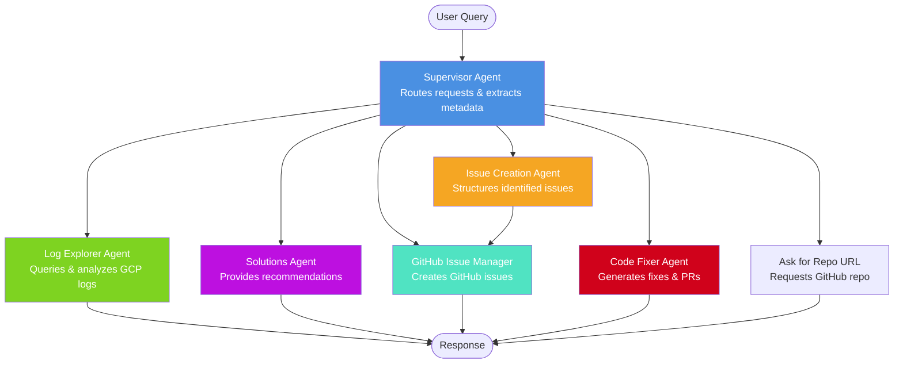
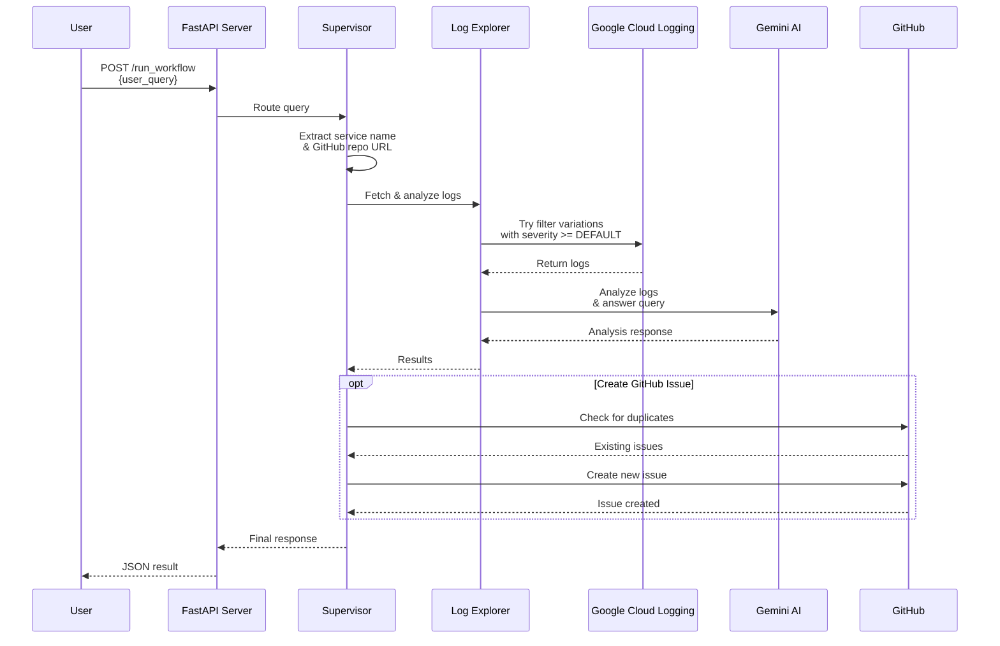
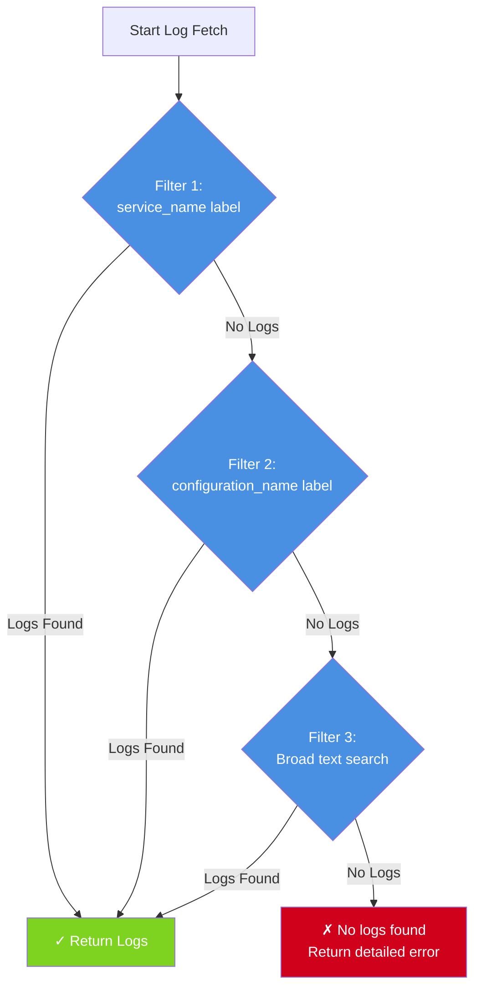

# Agentic Log Attacker

An AI-powered log monitoring and issue management system that uses LangGraph to orchestrate multiple specialized agents. The system monitors Google Cloud Run service logs, analyzes them using the Gemini API, identifies issues, and can automatically create GitHub issues with suggested fixes.

## Features

- **🔍 Intelligent Log Monitoring:** Advanced log retrieval from Google Cloud Run with multiple filter strategies and severity-based filtering
- **🤖 Multi-Agent Architecture:** Uses LangGraph to coordinate specialized AI agents for different tasks
- **📊 Issue Detection:** Analyzes logs using Gemini API to identify potential issues and patterns
- **🐙 GitHub Integration:** Automatically creates GitHub issues with duplicate detection
- **🔧 Automated Code Fixes:** Generates code fixes using AI and creates pull requests
- **💬 Conversational Interface:** Natural language queries to explore logs and issues

## Architecture

This application uses **LangGraph's StateGraph** to orchestrate multiple specialized agents that work together to analyze logs and manage issues.

### Multi-Agent System



### Agent Workflow Process



### Cloud Run Log Retrieval Strategy

The system uses an intelligent multi-filter approach to retrieve logs:



**All filters include:** `severity >= DEFAULT` to capture logs at all severity levels (DEFAULT, DEBUG, INFO, WARNING, ERROR, etc.)

## Setup

1. **Install dependencies:**

   ```bash
   pip install -r requirements.txt
   ```

2. **Set up your environment variables:**

   Create a `.env` file in the root of the project and add the following:

   ```
   GEMINI_API_KEY="YOUR_GEMINI_API_KEY"
   GITHUB_TOKEN="YOUR_GITHUB_TOKEN"
   GITHUB_REPOSITORY="YOUR_GITHUB_REPOSITORY"
   GOOGLE_CLOUD_PROJECT="YOUR_GOOGLE_CLOUD_PROJECT"
   CLOUD_RUN_SERVICE_NAME="YOUR_CLOUD_RUN_SERVICE_NAME"
   CLOUD_RUN_REGION="YOUR_CLOUD_RUN_REGION"
   ```

3. **Authenticate with Google Cloud:**

   ```bash
   gcloud auth application-default login
   ```

## Agent Descriptions

### 🎯 Supervisor Agent
- **Purpose:** Entry point and orchestrator
- **Responsibilities:** Routes user queries, extracts service names and GitHub URLs, decides which agent to invoke
- **Location:** `src/agents/supervisor.py`

### 📋 Log Explorer Agent
- **Purpose:** Log retrieval and analysis
- **Responsibilities:** Fetches GCP logs using multiple filter strategies, summarizes large log volumes, answers questions about log content
- **Location:** `src/agents/log_explorer.py`
- **Features:**
  - Tries 3 filter variations for log retrieval
  - Automatic log summarization for volumes >200 lines
  - Maintains conversation context for follow-up queries

### 🔨 Issue Creation Agent
- **Purpose:** Issue identification and structuring
- **Responsibilities:** Analyzes logs to identify problems, structures issues with priority and context
- **Location:** `src/agents/issue_creation_agent.py`

### 💡 Solutions Agent
- **Purpose:** Recommendation provider
- **Responsibilities:** Provides actionable recommendations for identified issues
- **Location:** `src/agents/solutions_agent.py`

### 🐙 GitHub Issue Manager Agent
- **Purpose:** GitHub integration
- **Responsibilities:** Creates GitHub issues, checks for duplicates, handles issue metadata
- **Location:** `src/agents/github_issue_manager.py`
- **Features:**
  - Duplicate detection (checks open and closed issues)
  - Skips issues closed with "wontfix" label
  - Extracts repo URLs from conversation history

### 🔧 Code Fixer Agent
- **Purpose:** Automated fix generation
- **Responsibilities:** Generates code fixes, creates branches, commits changes, creates pull requests
- **Location:** `src/agents/code_fixer.py`
- **Workflow:**
  1. Clones repository to temp directory
  2. Uses LLM to identify relevant files
  3. Reads only relevant files (reduces token usage)
  4. Generates fix and creates new branch
  5. Commits changes and creates PR

## Usage

### Running Locally (FastAPI)

To run the FastAPI application locally:

```bash
uvicorn src.main:app --host 0.0.0.0 --port 8080
```

The API will be available at `http://localhost:8080`. You can access the interactive API documentation at `http://localhost:8080/docs`.

### API Endpoints

#### `GET /`
Health check endpoint.

**Response:**
```json
{
  "message": "Agentic Log Attacker API is running!"
}
```

#### `POST /run_workflow`
Execute the multi-agent workflow with a user query.

**Request Body:**
```json
{
  "user_query": "review logs for cloud run service my-service"
}
```

**Example Queries:**
- `"review logs for cloud run service vllm-gemma-3-1b-it"`
- `"what errors occurred in the last hour?"`
- `"summarize recent logs"`
- `"create an issue for the authentication failures"`

**Response:**
```json
{
  "result": {
    "cloud_run_service": "my-service",
    "messages": [...],
    "issues": [...],
    "orchestrator_history": [...]
  }
}
```

## Development

### Running Tests

```bash
# Run all tests
pytest

# Run specific test file
pytest tests/test_conversation.py

# Run integration tests
pytest -m integration
```

### Testing Log Retrieval

Use the provided diagnostic scripts to test log fetching:

```bash
# Test log retrieval for a specific service
python test_service_logs.py

# Comprehensive diagnostics (lists all available services)
python debug_logs.py
```

These scripts will show:
- Each filter variation being attempted
- Which filter successfully finds logs
- Detailed diagnostic information about failures

## Deployment to Google Cloud Run

This project can be deployed to Google Cloud Run using Google Cloud Build. A `cloudbuild.yaml` file is provided for this purpose.

### Prerequisites

1. **Ensure you have Google Cloud SDK installed and authenticated.**

2. **Set up secrets in Google Cloud Secret Manager:**

   The application requires sensitive credentials to be stored as secrets:

   ```bash
   # Create the GEMINI_API_KEY secret
   echo -n "your-actual-gemini-api-key" | gcloud secrets create GEMINI_API_KEY --data-file=-

   # Create the GITHUB_TOKEN secret
   echo -n "your-actual-github-token" | gcloud secrets create GITHUB_TOKEN --data-file=-
   ```

3. **Grant Cloud Run access to the secrets:**

   ```bash
   # Get your project details
   export PROJECT_ID=$(gcloud config get-value project)
   export PROJECT_NUMBER=$(gcloud projects describe $PROJECT_ID --format='value(projectNumber)')

   # Grant access to GEMINI_API_KEY
   gcloud secrets add-iam-policy-binding GEMINI_API_KEY \
     --member="serviceAccount:${PROJECT_NUMBER}-compute@developer.gserviceaccount.com" \
     --role="roles/secretmanager.secretAccessor"

   # Grant access to GITHUB_TOKEN
   gcloud secrets add-iam-policy-binding GITHUB_TOKEN \
     --member="serviceAccount:${PROJECT_NUMBER}-compute@developer.gserviceaccount.com" \
     --role="roles/secretmanager.secretAccessor"
   ```

### Deploy

Once secrets are configured, submit the build to Cloud Build:

```bash
gcloud builds submit --config cloudbuild.yaml .
```

This command will build the Docker image, push it to Google Container Registry, and deploy it to Cloud Run. The service will be named `agentic-log-attacker` in the `us-central1` region (these can be customized in `cloudbuild.yaml`).

## Recent Improvements

### Enhanced Log Retrieval (v1.1)

**Multi-Filter Strategy:** The system now automatically tries multiple filter variations when fetching Cloud Run logs:

1. **Filter 1:** `resource.labels.service_name = "{service_name}"`
2. **Filter 2:** `resource.labels.configuration_name = "{service_name}"` (common for Cloud Run revisions)
3. **Filter 3:** Broad text search across all labels

**Severity Filtering:** All filters now include `severity >= DEFAULT` to ensure logs at all severity levels are captured, including:
- DEFAULT
- DEBUG
- INFO
- NOTICE
- WARNING
- ERROR
- CRITICAL
- ALERT
- EMERGENCY

**Diagnostic Logging:** Comprehensive logging shows which filter succeeds and provides actionable feedback when all filters fail.

### Benefits

- ✅ **Higher Success Rate:** Automatically adapts to different Cloud Run log label configurations
- ✅ **Better Visibility:** Detailed diagnostic output helps troubleshoot log retrieval issues
- ✅ **Complete Coverage:** Captures logs at all severity levels including DEFAULT
- ✅ **User-Friendly:** Provides clear, actionable error messages when logs aren't found

## Technology Stack

- **Framework:** FastAPI for REST API
- **Orchestration:** LangGraph (StateGraph) for multi-agent coordination
- **AI/LLM:** Google Gemini API (gemini-2.5-flash)
- **Cloud Platform:** Google Cloud Platform (Cloud Run, Cloud Logging)
- **Version Control:** GitHub (issues, pull requests)
- **Language:** Python 3.10+
- **Dependencies:**
  - `langchain_google_genai` - Gemini integration
  - `langgraph` - Agent orchestration
  - `google-cloud-logging` - GCP log access
  - `PyGithub` - GitHub API client
  - `pydantic` - Data validation
  - `fastapi` + `uvicorn` - Web API

## Project Structure

```
agentic-log-attacker/
├── src/
│   ├── agents/               # AI agents
│   │   ├── supervisor.py     # Request router
│   │   ├── log_explorer.py   # Log analysis
│   │   ├── issue_creation_agent.py
│   │   ├── solutions_agent.py
│   │   ├── github_issue_manager.py
│   │   └── code_fixer.py
│   ├── tools/                # Utility functions
│   │   ├── gcp_logging_tool.py
│   │   └── github_tool.py
│   └── main.py               # FastAPI app & workflow
├── tests/                    # Test suite
├── debug_logs.py             # GCP log diagnostics
├── test_service_logs.py      # Log retrieval testing
├── cloudbuild.yaml           # Cloud Build config
├── Dockerfile                # Container definition
├── requirements.txt          # Python dependencies
└── README.md                 # This file
```

## Contributing

Contributions are welcome! Please feel free to submit issues or pull requests.

## License

This project is available for use and modification as needed.
